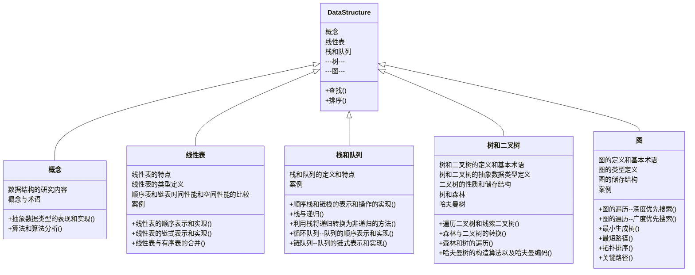

---
@author YQY
---

# Data Structure

## 知识结构

[TOC]




## 概念

### 数据结构的基本概念和术语

#### 数据、数据对象、数据元素、数据项

> 1. 数据（Data）:客观事物的符号表示，是所有能输入计算机中并被计算机处理的符号总称。
> 2. 数据对象（Data Object）:是性质相同的数据元素的集合，是数据的一个子集。
> 3. 数据元素（Data Element）:是数据的基本单位，计算机通常作为一个整体考虑处理。某些情况，也称元素、记录。
> 4. 数据项（Data Item）:组成数据元素的、具有独立含义的、不可分割的最小单位。

```c
//c
typedef int Elem;

struct demo{
    Elem DataItem;
}DataObject;

DataObject dataelem[10];//数据对象（十个元素构成的集）
dataelem[0].DataItem = 0;//
```

```java
//Java
class DataObject{
     private String[] DataItem;
     public DataObject(DataElem..){
            this.DataItem=DataElem;
     }
}
```


### 数据结构

> 常见的数据结构包括数组、链表、栈、队列、哈希表、树、堆、图，它们可以从“逻辑结构”和“物理结构”两个维度进行分类。

#### 逻辑结构

- 数据的**<u>逻辑结构</u>**是从逻辑关系上的描述，它与数据的储存无关，是独立与计算机的。因此，数据的**<u>逻辑结构</u>**可以看作从具体问题中抽象出来的**<u>数学模型</u>**。

- 数据的逻辑结构有两个要素：

  - 数据元素
  - 关系
  
- 数据元素的定义如前所述，关系指的是数据元素之间的逻辑关系，通常我们都能在具体事务和其关系中对应出数据元素和其关系，而根据数据元素的的不同特性，数据通常有四类基本逻辑结构：

  1. 集合结构

     结构中的数据元素之间除了**同属于一个集合的关系外，无其他任何关系**。

  2. 线性结构

     结权构中的数据元素之间**存在着一对一的线性关系**。

     **example.** 数组、链表、队列、栈、哈希表，元素之间是一对一的顺序关系。

  3. 树结构

     结构中的数据元素之间存**在着一对多的层次关系**。

     **example.**树、堆、哈希表，元素之间是一对多的关系。 

  4. 图结构或多网状结构

     结构中的数据元素之间**存在着多对多的任意关系**。

     **example.**图之间是多对多的关系。

- **逻辑结构揭示了数据元素之间的逻辑关系**。在数组和链表中，数据按照一定顺序排列，体现了数据之间的线性关系；而在树中，数据从顶部向下按层次排列，表现出“祖先”与“后代”之间的派生关系；图则由节点和边构成，反映了复杂的网络关系。

#### 储存结构 

- 数据对象在计算机的储存中表示为数据的**储存结构**，也称为**物理结构**。把数据对象存储到计算机时，通常要求**既要存储各数据元素的数据**，**又要存储数据元素之间的逻辑关系**，数据元素在计算机内通常用一个节点表示。数据元素在计算机中有两种**存储结构（物理结构）**，分别是**顺序结构和链式结构**。

  1. 顺序存储结构

     顺序存储结构是借助元素在存储器中的相对位置来表示数据之间的逻辑关系的，通常借助计算机程序的数组来实现。

     example.学生信息表；假定每个节点（学生记录）占用50个存储单元，如果采取**顺序结构**如数组，则**存储数据的地址是连续的**，数据从0号单元开始由低地址向高地址方向存储，表述如下：

     |   地址   |    学号     | 姓名   |      | 性别 |   籍贯   |  主修专业  |
     | :------: | :---------: | ------ | ---- | :--: | :------: | :--------: |
     | 0x000000 | 22202170222 | 俞菘白 |      |  女  | 湖北宜昌 | 政治经济学 |
     | 0x000050 | 22202170223 | 张振   |      |  男  | 湖北宜昌 |    法学    |
     | 0x000100 | 22202170224 | 熊宇杰 |      |  男  | 湖北宜昌 |   新闻学   |
     | 0x000150 | 22202170225 | 张志文 |      |  男  | 湖北宜昌 |  软件工程  |

     ```c
     //c-lang实现
     typedef struct{
         int isStuId;
         string isName;
         string isGender;
         string isHometown;
         string isMajor;
     }StudentData;
     //创建了学生的数据对象；
     
     StudentData studentdata[4];
     //创建了4位同学的信息（数据元素）的节点，此时已经开辟了（预留的）空间用于后续储存学生信息；
     
     studentdata[0].isStuId=22202170222;
     studentdata[0].isName="俞菘白";
     studentdata[0].isGender="女";
     studentdata[0].isHometown="湖北宜昌";
     studentdata[0].isMajor="政治经济学";
     //如此，便在第一个学生的节点中记录了该学生信息；
     
     studentdata[i].isStuId=...;
     studentdata[i].isName="";
     ...
     //以此类推
     ```

     

  2. 链式存储结构

     链式存储结构，无需像顺序存储结构一样将所有的元素依次存放在一片连续的空间中，**无需占用一整片连续空间**。但为了表示节点之间关系，需要给每个节点附加指针字段，用于存放直接后继的存储地址（有的情况会增添用于存放直接前驱或关键节点的地址的指针）。所以链式存储结构常借助于计算机设计语言的指针类型来描述。

     ```c
     //c-lang实现
     /* 链表节点结构体 */
     typedef struct ListNode {
         int val;               // 节点值
         struct ListNode *next; // 指向下一节点的指针
     } ListNode;
     
     /* 构造函数 */
     ListNode *newListNode(int val) {
         ListNode *node;
         node = (ListNode *) malloc(sizeof(ListNode));
         node->val = val;
         node->next = NULL;
         return node;
     }
     ```

     **<u>值得注意的是Java语言弱化甚至消除了指针特性，其实现方式并不使用指针，而是引用，但其表示方法仍然较为接近。</u>**

     ```java
     //Java实现
     /* 链表节点类 */
     class ListNode {
         int val;        // 节点值
         ListNode next;  // 指向下一节点的引用
         ListNode(int x) { val = x; }  // 构造函数
     }
     ```

     

     

- 

### 数据类型和抽象数据类型